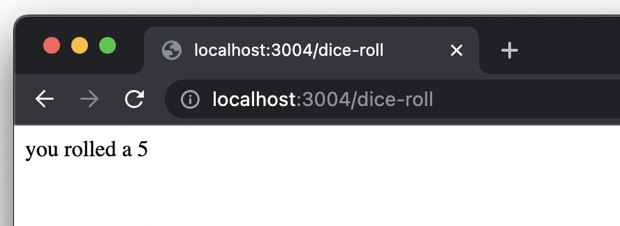
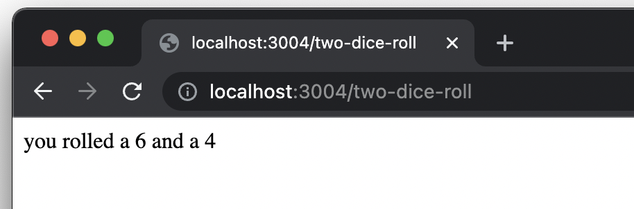
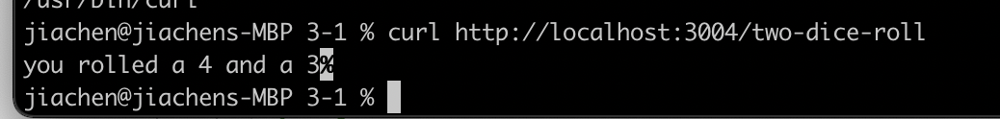

# 3.1 Dice Roll Exercise

### Instruction

#### Part 1: Dice Roll

1. Create an Express app that rolls a dice when the user sends a request to the /dice-roll route.
2. Send a response back to the client with the dice roll value.
3. Format the response output so it's easy to read.

#### Part 2: Two Dice Rolls

1. Add another "route" to the app /two-dice-rolls that rolls two dice and outputs their values to the client.
2. Request /two-dice-rolls with Chrome and with curl. Verify we get the same responses.

### Walkthrough

```
$ npm install
$ npm install express
$ node index.js
```

Part 1


Part 2 with Chrome


Part 2 with Curl
`curl http://localhost:3004/two-dice-roll`

