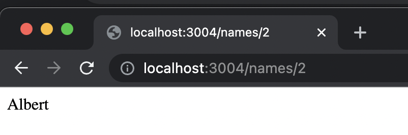
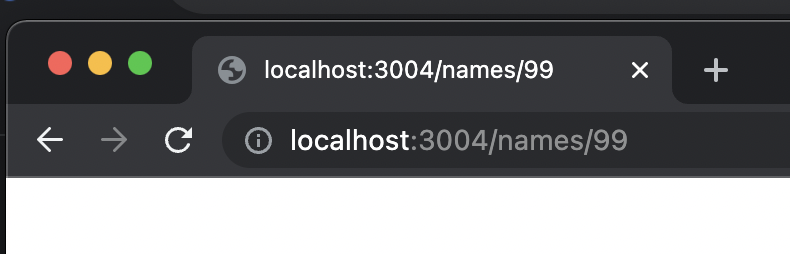

# 3.1.1 JSONDB Exercise

### Instruction

1. Reproduce the above JSON file-reading server.
2. What happens when the :index param in the request URL is not a valid array index in data.json?

### Run

```
$ npm install
$ npm install --save express
$ node index.js
```

### Walkthrough

1. Copy `jsonFileStorage.js` from [2.13](https://bootcamp.rocketacademy.co/2-backend-basics/2.13-json/2.13.3-json-file-storage-module-summary)

2. Visit `http://localhost:3004/names/2` in your browser



3. What happens when the :index param in the request URL is not a valid array index in data.json?
4. Since an out of bounds access in javascript returns `underfined`, we will see a blank page.


