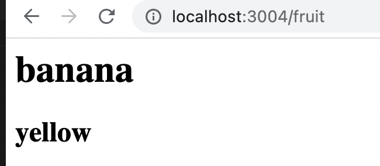
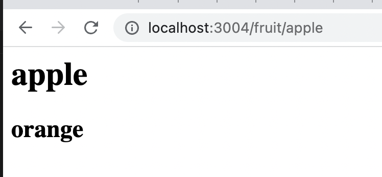

# 3.2 Exercise

## Instruction

1. Create a server with the above code and return HTML with EJS templating.
2. Add an h1 element to index.ejs and fill it with another attribute in the data object.
3. Create a new route with a path param like /fruits/:name. Inject the path param value in the response HTML by adding the param to the data object, then referencing it in the EJS template.

## Setup

```
$ npm install
$ node index.js
```

## Test

1. Visit `http://localhost:3004/fruit`


2. Visit `http://localhost:3004/fruit/apple`

