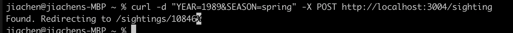
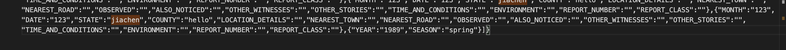
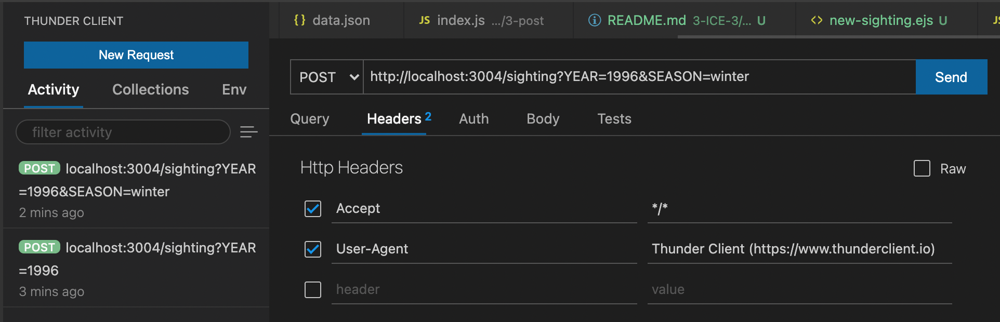

# 3.ICE.3: Bigfoot POST (Base + Comfortable)

Base copied from previous Bigfoot ICE

## Setup

```
$ npm install
$ node index.js
```

## Test via Curl

1. `curl -d "YEAR=1989&SEASON=spring" -X POST http://localhost:3004/sighting`
   
2. Check what new entry has been created in data.json
   

## Tets via Thunder Client


