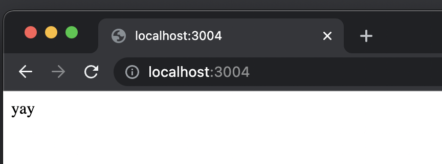

# 3.1 Setup Exercise

### Instruction

1. Clone the base [Node repo](https://github.com/rocketacademy/base-node-bootcamp)
2. Install the express library
3. Reproduce the Express server above

### Walkthrough

1. Copy and paste express code snippet into `index.js`.
2. Run

```shell
$ npm install --save express
$ npm install
$ node index.js
```

3. Visit `localhost:3004` in your browser


