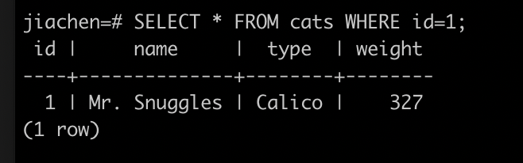

# 3.4.1: PostgreSQL, psql Exercise

## Setup
1. Install Postgress and psql
2. Initialize data base
3. create table and insert initial data
4. Run SQL queries

## Test
Example `SELECT * FROM cats WHERE id=1;`

